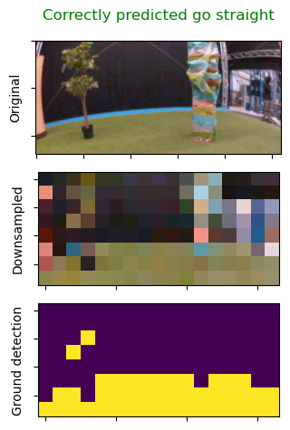
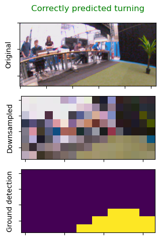
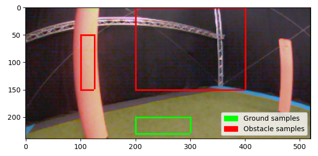

# mav_prototyping
This repository contains the Support Vector Machine (SVM) approach prototypes for both ground detection and deciding on where to go for the competition of the course Autonomous Flight for Micro Air Vehicles. This competition required each team to maximize the flown distance with a quadrotor, while avoiding obstacles - the caviat: only monocular vision is available for navigation.

## Feature extraction
The two images below show how an input image is down-sampled, the ground detection filter is applied, and finally fed
into the decision classification SVM.

  
  

## Ground classification
Please run the the floor_detection.py file. The features will be extracted, the SVM fitted, and some example filtered
images will be displayed. The SVM parameters are saved to "svm_V1.pkl".

The SVM needs training data. This is obtained from a single image by sampling different patches. The employed approach
seems manual labor efficient, as the data was obtained from a single image and the user only had to specify 2 vertices
for a total of 3 rectangles. This is shown in the image below.

  

## Decision classification
Please run decision_svm.py. The decision SVM will be trained and some examples from the test set will be displayed.
Note, that you can change some booleans:
- "binary", if True, the SVM will only predict between go straight and turn. If False, the SVM will do multiclass classification between left, straight, and right.
- "balance" ensures a balanced dataset by down sampling to the minority class count. Finally, you can run the function run_cross_val, to obtain a histogram with the cross validation scores.
